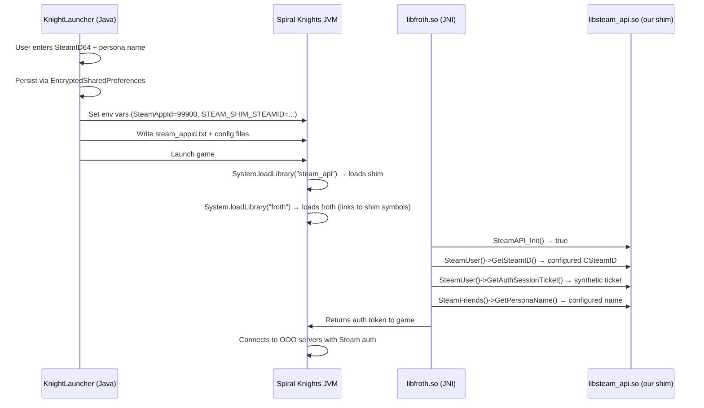

# Steam Authentication Emulation for Spiral Knights on Android

Build a native `libsteam_api.so` shim for Android (ARM64 + ARMv7) that emulates the Steamworks API surface [Froth](file:///d:/BigBoi/Github/froth) requires. The shim exports ~40 C++ functions verified from [froth's JNI source](file:///d:/BigBoi/Github/froth/src/cpp) — global API functions, interface accessors returning vtable-compatible objects, and callback registration stubs. Configuration (SteamID, persona) is injected via environment variables from the Android app.

> [!IMPORTANT]
> **Source-verified**: Froth uses `System.loadLibrary("steam_api")` from [SteamAPI.java:75-88](file:///d:/BigBoi/Github/froth/src/main/java/com/threerings/froth/SteamAPI.java#L75-L88), NOT `dlopen()`. The shim must be named `libsteam_api.so` and placed in the app's `nativeLibraryDir`.

> [!WARNING]
> **Biggest risk**: OOO servers call `SteamGameServer()->BeginAuthSession()` per [SteamGameServer.cpp:129](file:///d:/BigBoi/Github/froth/src/cpp/com_threerings_froth_SteamGameServer.cpp#L129). If they validate tickets with Valve, our synthetic ticket will be rejected. Fallback: normal username/password login.

---

## 1. Architecture

### How It Works



### Froth Three-Tier Architecture (from [DeepWiki](file:///d:/BigBoi/Github/TMP/froth/Architecture.md))

Froth is organized into three layers. Our shim **replaces Tier 3** entirely:

| Tier | Layer | What It Does | Our Shim's Role |
|---|---|---|---|
| 1 | **Java API** (`com.threerings.froth.Steam*`) | Type-safe Java interfaces | Untouched — calls native methods |
| 2 | **JNI Bridge** (`libfroth.so`, [src/cpp/](file:///d:/BigBoi/Github/froth/src/cpp)) | Translates Java calls → C++ SDK calls | Untouched — calls our shim's symbols |
| 3 | **Native SDK** (`libsteam_api.so`) | Steamworks SDK redistributable | **Replaced by our shim** |

### Call Chain (Verified)

Froth uses the **C++ Steamworks SDK pattern**, NOT the Flat API:

```
Java (SteamUser.getAuthSessionTicket)
  → JNI → com_threerings_froth_SteamUser.cpp
    → SteamUser()                         // Global accessor — returns ISteamUser*
      → ISteamUser::GetAuthSessionTicket() // Virtual method call through vtable
```

The shim must:

1. Export global accessor functions (`SteamUser()`, `SteamFriends()`, etc.)
2. Each accessor returns a pointer to a **C++ class with correct vtable layout**
3. Use the same Steamworks SDK headers froth was compiled against for ABI compatibility

---

## 2. Required API Surface

> All functions verified from froth's C++ JNI source and [Native-Library-Exports.md](file:///d:/BigBoi/Github/TMP/froth/Native-Library-Exports.md). Froth does **NOT** use the Flat API (`SteamAPI_ISteam*_*`).

### Global Functions — Shim Must Export

The shim must export **all 21 symbols** that `libfroth.so` imports from `libsteam_api.so`:

| Export | Source | Shim Behavior |
|---|---|---|
| `SteamAPI_Init()` | [SteamAPI.cpp:11](file:///d:/BigBoi/Github/froth/src/cpp/com_threerings_froth_SteamAPI.cpp#L11) | Load config from env vars, return `true` |
| `SteamAPI_Shutdown()` | [SteamAPI.cpp:16](file:///d:/BigBoi/Github/froth/src/cpp/com_threerings_froth_SteamAPI.cpp#L16) | No-op |
| `SteamAPI_IsSteamRunning()` | [SteamAPI.cpp:22](file:///d:/BigBoi/Github/froth/src/cpp/com_threerings_froth_SteamAPI.cpp#L22) | Return `true` |
| `SteamAPI_RunCallbacks()` | [SteamAPI.cpp:28](file:///d:/BigBoi/Github/froth/src/cpp/com_threerings_froth_SteamAPI.cpp#L28) | Dispatch pending `GetAuthSessionTicketResponse_t` |
| `SteamAPI_RegisterCallback()` | [DeepWiki imports](file:///d:/BigBoi/Github/TMP/froth/Native-Library-Exports.md#L243) | Store callback pointer in registry |
| `SteamAPI_UnregisterCallback()` | [DeepWiki imports](file:///d:/BigBoi/Github/TMP/froth/Native-Library-Exports.md#L243) | Remove from registry |
| `SteamAPI_RegisterCallResult()` | [DeepWiki imports](file:///d:/BigBoi/Github/TMP/froth/Native-Library-Exports.md#L244) | Store call-result pointer |
| `SteamAPI_UnregisterCallResult()` | [DeepWiki imports](file:///d:/BigBoi/Github/TMP/froth/Native-Library-Exports.md#L245) | Remove call-result pointer |
| `SteamUser()` | [SteamUser.cpp:64+](file:///d:/BigBoi/Github/froth/src/cpp/com_threerings_froth_SteamUser.cpp#L64) | Return `ISteamUser*` singleton |
| `SteamFriends()` | [SteamFriends.cpp:58+](file:///d:/BigBoi/Github/froth/src/cpp/com_threerings_froth_SteamFriends.cpp#L58) | Return `ISteamFriends*` singleton |
| `SteamApps()` | [SteamApps.cpp:32](file:///d:/BigBoi/Github/froth/src/cpp/com_threerings_froth_SteamApps.cpp#L32) | Return `ISteamApps*` singleton |
| `SteamUtils()` | [SteamUtils.cpp:11](file:///d:/BigBoi/Github/froth/src/cpp/com_threerings_froth_SteamUtils.cpp#L11) | Return `ISteamUtils*` singleton |
| `SteamController()` | [DeepWiki imports](file:///d:/BigBoi/Github/TMP/froth/Native-Library-Exports.md#L246) | Return `ISteamController*` singleton (all no-ops) |
| `SteamMatchmaking()` | [DeepWiki imports](file:///d:/BigBoi/Github/TMP/froth/Native-Library-Exports.md#L256) | Return `ISteamMatchmaking*` singleton (all no-ops) |
| `SteamNetworking()` | [DeepWiki imports](file:///d:/BigBoi/Github/TMP/froth/Native-Library-Exports.md#L257) | Return `ISteamNetworking*` singleton (all no-ops) |
| `SteamGameServer()` | [SteamGameServer.cpp](file:///d:/BigBoi/Github/froth/src/cpp/com_threerings_froth_SteamGameServer.cpp) | Return `ISteamGameServer*` singleton |
| `SteamGameServer_Init(...)` | [DeepWiki imports](file:///d:/BigBoi/Github/TMP/froth/Native-Library-Exports.md#L250) | Return `true` |
| `SteamGameServer_Shutdown()` | [DeepWiki imports](file:///d:/BigBoi/Github/TMP/froth/Native-Library-Exports.md#L251) | No-op |
| `SteamGameServer_RunCallbacks()` | [DeepWiki imports](file:///d:/BigBoi/Github/TMP/froth/Native-Library-Exports.md#L252) | No-op |
| `SteamGameServerStats()` | [DeepWiki imports](file:///d:/BigBoi/Github/TMP/froth/Native-Library-Exports.md#L253) | Return singleton (all no-ops) |
| `SteamGameServerUtils()` | [SteamUtils.cpp:12](file:///d:/BigBoi/Github/froth/src/cpp/com_threerings_froth_SteamUtils.cpp#L12) | Same as `SteamUtils()` |

### ISteamUser — 13 Virtual Methods

Source: [com_threerings_froth_SteamUser.cpp](file:///d:/BigBoi/Github/froth/src/cpp/com_threerings_froth_SteamUser.cpp), [SteamUser exports](file:///d:/BigBoi/Github/TMP/froth/Native-Library-Exports.md#L185-L209)

| Method | Shim Behavior |
|---|---|
| `BLoggedOn()` | Return `true` |
| `GetSteamID()` | Return configured SteamID |
| **`GetAuthSessionTicket(buf, max, &len, nullptr)`** | **CRITICAL** — generate gbe_fork-format ticket, queue callback |
| `CancelAuthTicket(handle)` | No-op |
| `InitiateGameConnection(buf, max, steamId, ip, port, secure)` | Return 0 (not used for SK but exported) |
| `TerminateGameConnection(ip, port)` | No-op |
| `StartVoiceRecording()` | No-op |
| `StopVoiceRecording()` | No-op |
| `GetVoiceOptimalSampleRate()` | Return 0 |
| `GetAvailableVoice(...)` | Return `k_EVoiceResultNoData` |
| `GetVoice(...)` | Return `k_EVoiceResultNoData` |
| `DecompressVoice(...)` | Return `k_EVoiceResultNoData` |

Froth passes 4 args to `GetAuthSessionTicket` — the last being `nullptr` for `SteamNetworkingIdentity*`:

```c
SteamUser()->GetAuthSessionTicket(buf, cap, &len, 0);  // line 95-98
```

### ISteamFriends — 11 Virtual Methods

Source: [com_threerings_froth_SteamFriends.cpp](file:///d:/BigBoi/Github/froth/src/cpp/com_threerings_froth_SteamFriends.cpp), [SteamFriends exports](file:///d:/BigBoi/Github/TMP/froth/Native-Library-Exports.md#L95-L119)

| Method | Shim Behavior |
|---|---|
| `GetPersonaName()` | Return configured name |
| `GetFriendCount(flags)` | Return 0 |
| `GetFriendByIndex(idx, flags)` | Return invalid CSteamID |
| `GetFriendPersonaName(steamId)` | Return `""` |
| `SetInGameVoiceSpeaking(steamId, speaking)` | No-op |
| `ActivateGameOverlayToWebPage(url)` | No-op |
| `ActivateGameOverlayToStore(appId, flag)` | No-op |
| `SetRichPresence(key, val)` | Return `true` |
| `GetFriendRichPresence(steamId, key)` | Return `""` |
| `InviteUserToGame(steamId, connectStr)` | Return `false` |
| `GetFriendPersonaState(steamId)` | Return online |

### ISteamApps — 2 Methods / ISteamUtils — 5 Methods

| Interface | Method | Shim Behavior |
|---|---|---|
| Apps | `GetCurrentGameLanguage()` | Return `"english"` |
| Apps | `BIsDlcInstalled(appId)` | Return `false` |
| Utils | `GetAppID()` | Return `99900` |
| Utils | `SetWarningMessageHook(fn)` | Store, no-op |
| Utils | `IsOverlayEnabled()` | Return `false` |
| Utils | `BOverlayNeedsPresent()` | Return `false` |
| Utils | `SetOverlayNotificationPosition(pos)` | No-op |

### GameServer Functions (client shouldn't call these, stub as safety)

Source: [Authentication-Guide.md](file:///d:/BigBoi/Github/TMP/froth/Authentication-Guide.md), [SteamGameServer exports](file:///d:/BigBoi/Github/TMP/froth/Native-Library-Exports.md#L121-L135)

| Method | Shim Behavior |
|---|---|
| `SteamGameServer()->BeginAuthSession(...)` | Return OK |
| `SteamGameServer()->EndAuthSession(...)` | No-op |
| `SteamGameServer()->SendUserConnectAndAuthenticate(...)` | Return `true` |
| `SteamGameServer()->SendUserDisconnect(...)` | No-op |
| `SteamGameServerStats()->SetUserAchievement(...)` | No-op |
| `SteamGameServerStats()->ClearUserAchievement(...)` | No-op |

### Callback System (from [Callback-System.md](file:///d:/BigBoi/Github/TMP/froth/Callback-System.md))

Froth uses **two callback patterns** — both managed by the Steamworks SDK internally:

| Pattern | Mechanism | Used For | Our Shim Must... |
|---|---|---|---|
| **Persistent** | `STEAM_CALLBACK` macro → `SteamAPI_RegisterCallback()` | `SteamServersConnected_t`, overlay, etc. | Accept + ignore registration |
| **One-shot** | `CCallResult<>` → `SteamAPI_RegisterCallResult()` | Lobby creation (not used by SK client) | Accept + ignore registration |

Only callback we **must actively fire**: `GetAuthSessionTicketResponse_t` (after 30ms delay).

All others can be safely registered but never fired — the game continues without them.

| Callback Type | Registered In |
|---|---|
| `GetAuthSessionTicketResponse_t` | **Must fire** after `GetAuthSessionTicket()` with 30ms delay |
| `SteamServersConnected_t` | [SteamUser.cpp:21](file:///d:/BigBoi/Github/froth/src/cpp/com_threerings_froth_SteamUser.cpp#L21) |
| `SteamServersDisconnected_t` | [SteamUser.cpp:28](file:///d:/BigBoi/Github/froth/src/cpp/com_threerings_froth_SteamUser.cpp#L28) |
| `MicroTxnAuthorizationResponse_t` | [SteamUser.cpp:49](file:///d:/BigBoi/Github/froth/src/cpp/com_threerings_froth_SteamUser.cpp#L49) |
| `GameOverlayActivated_t` | [SteamFriends.cpp:19](file:///d:/BigBoi/Github/froth/src/cpp/com_threerings_froth_SteamFriends.cpp#L19) |
| `GameRichPresenceJoinRequested_t` | [SteamFriends.cpp:41](file:///d:/BigBoi/Github/froth/src/cpp/com_threerings_froth_SteamFriends.cpp#L41) |
| `DlcInstalled_t` | [SteamApps.cpp:18](file:///d:/BigBoi/Github/froth/src/cpp/com_threerings_froth_SteamApps.cpp#L18) |
| `GSClientApprove_t` / `GSClientDeny_t` | [SteamGameServer.cpp:56-73](file:///d:/BigBoi/Github/froth/src/cpp/com_threerings_froth_SteamGameServer.cpp#L56) |
| `ValidateAuthTicketResponse_t` | [SteamGameServer.cpp:90](file:///d:/BigBoi/Github/froth/src/cpp/com_threerings_froth_SteamGameServer.cpp#L90) |

---

## 3. Auth Ticket Format

Verified from [auth.cpp](file:///d:/BigBoi/Github/gbe_fork/dll/auth.cpp) and [auth.h](file:///d:/BigBoi/Github/gbe_fork/dll/dll/auth.h). See also [Authentication-Guide.md](file:///d:/BigBoi/Github/TMP/froth/Authentication-Guide.md) for the complete authentication workflow.

### Full Ticket (236 bytes for SK)

```
=== AppTicketGC (24 bytes) ===
0x00  u32  GCLen = 20
0x04  u64  GCToken (random: ticket_id << 32 | rand)
0x0C  u64  SteamID
0x14  u32  ticketGenDate (epoch)

=== AppTicketSession (28 bytes) ===
0x18  u32  SessionLen = 24
0x1C  u32  one = 1
0x20  u32  two = 2
0x24  u32  ExternalIP (127.0.0.1 → 0x0100007F LE)
0x28  u32  InternalIP (same)
0x2C  u32  TimeSinceStartup (seconds)
0x30  u32  TicketGeneratedCount (monotonic)

=== Length Prefix (4 bytes) ===
0x34  u32  remaining_length

=== Ticket Data Length (4 bytes) ===
0x38  u32  ticket_data_layout_length

=== AppTicket (48 bytes for SK) ===
0x3C  u32  Version = 4
0x40  u64  SteamID
0x48  u32  AppId = 99900
0x4C  u32  ExternalIP
0x50  u32  InternalIP
0x54  u32  AlwaysZero = 0
0x58  u32  TicketGenDate (epoch)
0x5C  u32  TicketExpireDate (GenDate + 86400)
0x60  u16  licenses_count = 1
0x62  u32  License[0] = 0
0x66  u16  dlcs_count = 0
0x68  u16  padding = 0

=== RSA-1024 Signature (128 bytes) ===
0x6A  128  RSA signature over ticket data
```

### Legacy Ticket (24 bytes, fallback)

```
0x00  u32  gc_len = 20
0x04  u64  token (random)
0x0C  u64  steam_id
0x14  u32  ticket_gen_date
```

### Post-Generation Callback

From [auth.cpp:833-838](file:///d:/BigBoi/Github/gbe_fork/dll/auth.cpp#L833-L838): gbe_fork fires `GetAuthSessionTicketResponse_t` after **30ms** (`STEAM_TICKET_PROCESS_TIME`). Our shim must do the same — if froth waits for this callback before sending the ticket, omitting it causes a hang.

---

## 4. Vtable Compatibility

Froth calls methods via C++ virtual dispatch ([JNI-Bridge-Design.md](file:///d:/BigBoi/Github/TMP/froth/JNI-Bridge-Design.md)). Our shim classes must have **matching vtable layouts**.

**Approach**: Inherit from the same Steamworks SDK abstract base classes (`ISteamUser`, etc.) that froth was compiled against. The compiler generates matching vtables automatically.

```cpp
// Simplified pattern — each accessor returns a singleton
static SteamUserShim g_steamUser;
ISteamUser* SteamUser() { return &g_steamUser; }
```

To determine the exact SDK version froth uses, run `readelf -s libfroth.so` and look for interface version strings or symbol mangling.

---

## 5. Java Integration

### KnightLauncher-Android Integration Points

Key files from [KnightLauncher-Android source](file:///d:/BigBoi/Github/KnightLauncher-Android) and [DeepWiki docs](file:///d:/BigBoi/Github/TMP/KnightLauncher-Android):

| Integration Point | File | Lines | Purpose |
|---|---|---|---|
| **Env var injection** | [JREUtils.java](file:///d:/BigBoi/Github/KnightLauncher-Android/app_pojavlauncher/src/main/java/net/kdt/pojavlaunch/utils/JREUtils.java#L179-L289) | 179-289 | `setJavaEnvironment()` — add Steam env vars here |
| **Custom env fallback** | [JREUtils.java](file:///d:/BigBoi/Github/KnightLauncher-Android/app_pojavlauncher/src/main/java/net/kdt/pojavlaunch/utils/JREUtils.java#L291-L303) | 291-303 | `readCustomEnv()` reads `custom_env.txt` (runs last) |
| **LD_LIBRARY_PATH setup** | [JREUtils.java](file:///d:/BigBoi/Github/KnightLauncher-Android/app_pojavlauncher/src/main/java/net/kdt/pojavlaunch/utils/JREUtils.java#L150-L177) | 150-177 | `NATIVE_LIB_DIR` appended at L175 |
| **Launch entry** | [Tools.java](file:///d:/BigBoi/Github/KnightLauncher-Android/app_pojavlauncher/src/main/java/net/kdt/pojavlaunch/Tools.java#L226-L293) | 226-293 | `launchMinecraft()` — config files must be written before this |
| **Version info** | [Tools.java](file:///d:/BigBoi/Github/KnightLauncher-Android/app_pojavlauncher/src/main/java/net/kdt/pojavlaunch/Tools.java#L752-L806) | 752-806 | `getVersionInfo()` — main class `ProjectXApp`, Java 8 |
| **NDK ABI filter** | [build.gradle](file:///d:/BigBoi/Github/KnightLauncher-Android/app_pojavlauncher/build.gradle#L46-L49) | 46-49 | `abiFilters 'armeabi-v7a', 'arm64-v8a'` |
| **jniLibs packaging** | [build.gradle](file:///d:/BigBoi/Github/KnightLauncher-Android/app_pojavlauncher/build.gradle#L115-L118) | 115-118 | `useLegacyPackaging = true` (uncompressed in APK) |
| **Native lib init** | [JREUtils.java](file:///d:/BigBoi/Github/KnightLauncher-Android/app_pojavlauncher/src/main/java/net/kdt/pojavlaunch/utils/JREUtils.java#L78-L98) | 78-98 | `initJavaRuntime()` loads JVM libs via `dlopen()` |

### SteamAuthManager.java (credential storage)

Wraps `EncryptedSharedPreferences` to store SteamID64 + persona name. Methods: `login()`, `logout()`, `isLoggedIn()`, `getSteamId64()`, `getPersonaName()`.

**Dependency**: `androidx.security:security-crypto:1.1.0-alpha06`

### SteamConfigWriter.java (pre-launch config)

Writes before game launch (before `Tools.launchMinecraft()` is called):

- `{gameDir}/steam_appid.txt` → `99900\n`
- `{gameDir}/steam_settings/configs.user.ini`:

```ini
[user::general]
account_name=PlayerName
account_steamid=76561198012345678
language=english
```

### MainMenuFragment.java (UI)

Add Steam login/logout button. Login dialog collects SteamID64 (17-digit number) + display name. Button shows `"Steam: PlayerName"` when logged in.

### JREUtils.java (env vars)

Set before JVM launch in `setJavaEnvironment()` (around [L271](file:///d:/BigBoi/Github/KnightLauncher-Android/app_pojavlauncher/src/main/java/net/kdt/pojavlaunch/utils/JREUtils.java#L271) — before `readCustomEnv()`):

```java
// Steam auth env vars (when SteamAuthManager.isLoggedIn())
envMap.put("SteamAppId", "99900");
envMap.put("SteamGameId", "99900");
envMap.put("STEAM_SHIM_STEAMID", steamAuthManager.getSteamId64());
envMap.put("STEAM_SHIM_PERSONA", steamAuthManager.getPersonaName());
```

### Shim .so Placement

The shim goes in `jniLibs/` → packaged into APK `lib/` → extracted to `NATIVE_LIB_DIR` → already on `LD_LIBRARY_PATH`:

```
app_pojavlauncher/src/main/jniLibs/arm64-v8a/libsteam_api.so
app_pojavlauncher/src/main/jniLibs/armeabi-v7a/libsteam_api.so
```

This mirrors how [GL4ES](file:///d:/BigBoi/Github/TMP/KnightLauncher-Android/Native-Libraries.md) is packaged.

---

## 6. Build

### Cross-Compile (C++ — requires NDK)

```bash
export NDK=/path/to/android-ndk-r27c
export API=21

# arm64-v8a
$NDK/toolchains/llvm/prebuilt/linux-x86_64/bin/aarch64-linux-android${API}-clang++ \
    -shared -fPIC -std=c++17 -o libsteam_api.so steam_shim.cpp

# armeabi-v7a
$NDK/toolchains/llvm/prebuilt/linux-x86_64/bin/armv7a-linux-androideabi${API}-clang++ \
    -shared -fPIC -std=c++17 -o libsteam_api.so steam_shim.cpp
```

### Symbol Verification

```bash
# Verify our shim exports what froth needs
nm -D libsteam_api.so | grep -E "SteamAPI_Init|SteamUser|SteamFriends|RegisterCallback"

# Cross-check against froth's imports (on device)
readelf -s libfroth.so | grep UND | grep -i steam
```

---

## 7. Risk Assessment

| Risk | Severity | Likelihood | Mitigation |
|---|---|---|---|
| **OOO validates tickets with Valve** | Critical | Medium | `BeginAuthSession()` found in [froth server code](file:///d:/BigBoi/Github/froth/src/cpp/com_threerings_froth_SteamGameServer.cpp#L129). Fall back to non-Steam login |
| **Vtable layout mismatch** | High | Low | Use same SDK headers froth compiled against; verify with `nm`/`objdump` |
| **`System.loadLibrary` can't find shim** | High | Medium | Place in `jniLibs/`; already on [LD_LIBRARY_PATH](file:///d:/BigBoi/Github/KnightLauncher-Android/app_pojavlauncher/src/main/java/net/kdt/pojavlaunch/utils/JREUtils.java#L175) |
| **Callback registration crashes** | Medium | Medium | Implement `SteamAPI_RegisterCallback`/`UnregisterCallback` as no-ops that accept but ignore pointers |
| **Voice API crashes** | Low | Low | Return no-data for all 6 voice functions |

---

## 8. Real vs Emulated Auth

See [Authentication-Guide.md](file:///d:/BigBoi/Github/TMP/froth/Authentication-Guide.md) for the full real auth workflow.

| Step | Real Steam (JavaSteam) | Our Shim |
|---|---|---|
| Connect to Steam CM | TCP/UDP/WebSocket + RSA handshake | **Skipped** |
| Login | Credentials + 2FA | **Skipped** — SteamID from user input |
| Get GameConnectTokens | From CM server | **Skipped** |
| Build auth ticket | Server-signed | **Locally generated** (gbe_fork format) |
| Validate ticket | CM server verifies CRC | **Skipped** |
| Server-side validation | `BeginAuthSession()` → Valve confirms | **Unknown** — may fail |

---

## 9. Reference Index

### Source Repos

| Label | Path |
|---|---|
| Froth source | [d:/BigBoi/Github/froth](file:///d:/BigBoi/Github/froth) |
| KnightLauncher-Android | [d:/BigBoi/Github/KnightLauncher-Android](file:///d:/BigBoi/Github/KnightLauncher-Android) |
| gbe_fork (ticket format ref) | [d:/BigBoi/Github/gbe_fork](file:///d:/BigBoi/Github/gbe_fork) |
| JavaSteam (real auth ref) | [d:/BigBoi/Github/JavaSteam](file:///d:/BigBoi/Github/JavaSteam) |

### DeepWiki Docs

| Doc | Path | Key Insight |
|---|---|---|
| Froth Architecture | [TMP/froth/Architecture.md](file:///d:/BigBoi/Github/TMP/froth/Architecture.md) | Three-tier design, library loading order |
| JNI Bridge Design | [TMP/froth/JNI-Bridge-Design.md](file:///d:/BigBoi/Github/TMP/froth/JNI-Bridge-Design.md) | Type marshalling, ByteBuffer → native pointers |
| Native Library Exports | [TMP/froth/Native-Library-Exports.md](file:///d:/BigBoi/Github/TMP/froth/Native-Library-Exports.md) | **Complete 21-symbol import list** from `libsteam_api.so` |
| Callback System | [TMP/froth/Callback-System.md](file:///d:/BigBoi/Github/TMP/froth/Callback-System.md) | Persistent vs one-shot callbacks, `STEAM_CALLBACK` / `CCallResult` |
| Authentication Guide | [TMP/froth/Authentication-Guide.md](file:///d:/BigBoi/Github/TMP/froth/Authentication-Guide.md) | Full auth workflow: ticket gen → server validation |
| KL-A Game Launching | [TMP/KnightLauncher-Android/Game-Launching-System.md](file:///d:/BigBoi/Github/TMP/KnightLauncher-Android/Game-Launching-System.md) | Launch pipeline, `Tools.launchMinecraft()` |
| KL-A Native Libraries | [TMP/KnightLauncher-Android/Native-Libraries.md](file:///d:/BigBoi/Github/TMP/KnightLauncher-Android/Native-Libraries.md) | jniLibs structure, APK packaging |
| KL-A Launch Pipeline | [TMP/KnightLauncher-Android/Launch-Pipeline.md](file:///d:/BigBoi/Github/TMP/KnightLauncher-Android/Launch-Pipeline.md) | 8-stage pipeline, env vars, LD_LIBRARY_PATH |

### Key Source Files

| File | Purpose |
|---|---|
| [SteamAPI.java:75-88](file:///d:/BigBoi/Github/froth/src/main/java/com/threerings/froth/SteamAPI.java#L75-L88) | `System.loadLibrary("steam_api")` — loading mechanism |
| [SteamUser.java:151-161](file:///d:/BigBoi/Github/froth/src/main/java/com/threerings/froth/SteamUser.java#L151-L161) | `getAuthSessionTicket()` Java wrapper |
| [com_threerings_froth_SteamUser.cpp:91-101](file:///d:/BigBoi/Github/froth/src/cpp/com_threerings_froth_SteamUser.cpp#L91-L101) | JNI → `SteamUser()->GetAuthSessionTicket()` |
| [com_threerings_froth_SteamGameServer.cpp:125-143](file:///d:/BigBoi/Github/froth/src/cpp/com_threerings_froth_SteamGameServer.cpp#L125-L143) | `BeginAuthSession()` server validation |
| [auth.cpp](file:///d:/BigBoi/Github/gbe_fork/dll/auth.cpp) | gbe_fork ticket format |
| [JREUtils.java:179-289](file:///d:/BigBoi/Github/KnightLauncher-Android/app_pojavlauncher/src/main/java/net/kdt/pojavlaunch/utils/JREUtils.java#L179-L289) | Env var injection point |
| [Tools.java:226-293](file:///d:/BigBoi/Github/KnightLauncher-Android/app_pojavlauncher/src/main/java/net/kdt/pojavlaunch/Tools.java#L226-L293) | Game launch entry point |

---

## 10. Implementation Checklist

- [ ] **Phase 1: Native Shim**
  - [ ] Create `steam_shim/steam_shim.cpp` with C++ vtable-compatible interface classes
  - [ ] Include Steamworks SDK headers matching froth's version
  - [ ] Export all 21 required symbols (see §2)
  - [ ] Implement `GetAuthSessionTicket()` with gbe_fork ticket format (§3)
  - [ ] Implement `SteamAPI_RegisterCallback`/`UnregisterCallback` as no-op registry
  - [ ] Implement minimal callback dispatch for `GetAuthSessionTicketResponse_t` (30ms delay)
  - [ ] Cross-compile for arm64-v8a + armeabi-v7a (§6)
  - [ ] Verify symbols via `nm -D`

- [ ] **Phase 2: Java Integration**
  - [ ] Add `androidx.security:security-crypto` dependency to [build.gradle](file:///d:/BigBoi/Github/KnightLauncher-Android/app_pojavlauncher/build.gradle)
  - [ ] Create `SteamAuthManager.java`
  - [ ] Create `SteamConfigWriter.java`
  - [ ] Add Steam login/logout UI to `MainMenuFragment`
  - [ ] Set env vars in [JREUtils.setJavaEnvironment()](file:///d:/BigBoi/Github/KnightLauncher-Android/app_pojavlauncher/src/main/java/net/kdt/pojavlaunch/utils/JREUtils.java#L179)

- [ ] **Phase 3: Testing**
  - [ ] `libfroth.so` symbol check (`readelf -s | grep UND`)
  - [ ] Build debug APK, test login/logout UI
  - [ ] Test game launch with Steam auth
  - [ ] Test fallback (without Steam login → normal login dialog)
  - [ ] Test credential persistence across app restarts

---

## 11. Open Questions

| Item | Status |
|---|---|
| Whether OOO servers accept synthetic auth tickets | **Unknown** — must test empirically |
| Exact Steamworks SDK version froth was compiled against | **Verify** — check `libfroth.so` symbols |
| Exact layout XML used by `MainMenuFragment` | **Verify** — check fragment inflation |
| Whether `SteamController`/`SteamMatchmaking`/`SteamNetworking` vtables need full layouts | **Likely no** — SK client doesn't use these, but froth exports them |
